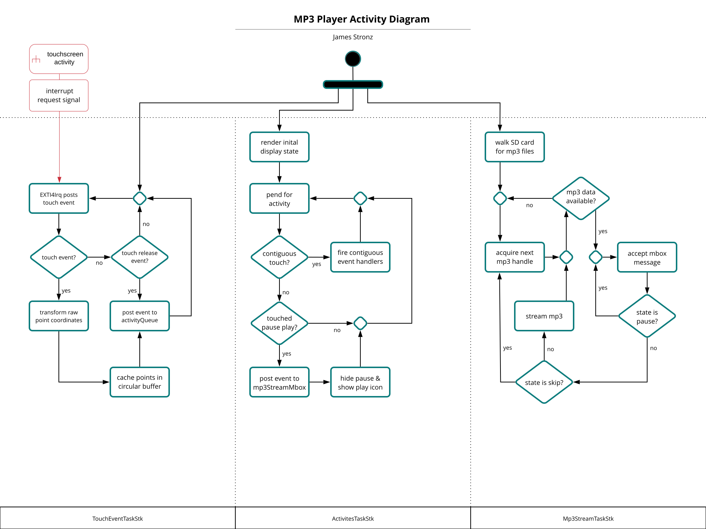

# MP3 Player Project

The aim of my project was to emphasize features that are more unique to embedded systems. Play, pause, and play-state functions function
much like other music applications. Touch events propagate into activities which fire handlers to synchronize state between contexts.
Synchronization between contexts is relies on uCOS messaging mailboxes and queues.

Features:
* Custom play button "▶"    
* Custom pause button "⏸️"    
* The play button and pause button toggle to indicate play like spotify does     
* Read songs from SD    
* Walk SD for mp3 files to load

How these features work under the hood is detailed in a Activity Diagram.

TouchEventTaskStk, ActivitesTaskStk, and MP3StreamTaskStk are the names of stacks allocated for the uCOS tasks TouchEventTask, ActivitesTask, and MP3StreamTask respectively. TouchEventTask handles user input and provides the information to the ActivitiesTask. The
behavior of ActivitesTask does vary, but primarly brokers and arbitrates what should happen with all of the "activites" going on.

An often overlooked detail is the less than trivial nature of interpreting contiguous touch events as gestures, a ubiquitous feature of smart phones. The pause/play event handler fires if the ActivitiesTask determines that user touch ended on the button, as implemented.
More over, touch events are queued to ActivitesTask. When the ActivitiesTask deduces there are no more touch events, the last valid touch
screen point is used for the point of release. The point of release determines which button is clicked, thereby firing event handlers such
as pausing the MP3StreamTask.
