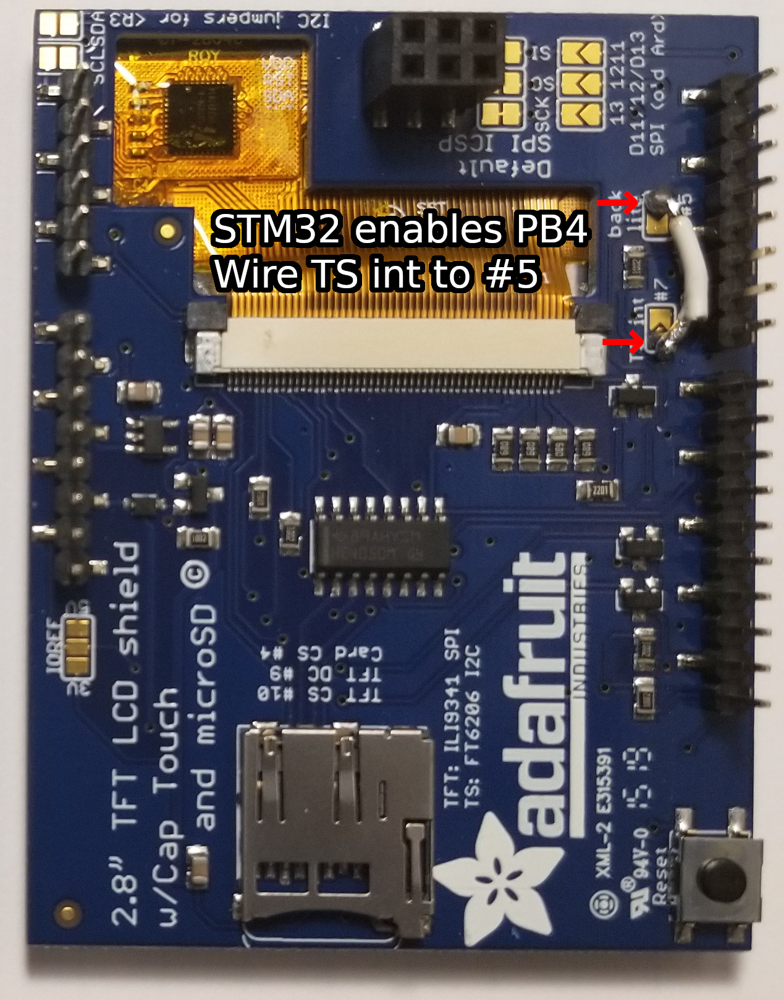

# MP3 Player Project

The aim of my project was to emphasize features that were characteristic of embedded systems. Play, pause, and skip icons behave like other music applications in that play status is implicitly indicated by pause-play icon toggle.
A complete list of features can be found at the end of file. From ten-thousand feat, an Activity Diagram summarizes how things work.    

TouchEventTaskStk, ActivitesTaskStk, and MP3StreamTaskStk are the names of stacks allocated for the uCOS tasks TouchEventTask, ActivitesTask, and MP3StreamTask respectively. TouchEventTask handles user input and provides the information to the ActivitiesTask. The
behavior of ActivitesTask does vary, but primarly brokers and arbitrates what should happen with all of the "activites" going on.

An often overlooked detail is the less than trivial nature of interpreting contiguous touch events as gestures, a ubiquitous feature of smart phones. The pause/play event handler fires if the ActivitiesTask determines that user touch ended on the button, as implemented.
More over, touch events are queued to ActivitesTask. When the ActivitiesTask deduces there are no more touch events, the last valid touch
screen point is used for the point of release. The point of release determines which button is clicked, thereby firing event handlers such
as pausing the MP3StreamTask.

Features:
* Play button "▶"    
* Pause button "⏸️"    
* Skip button "⏭️"    
* The play button and pause button toggle to indicate play like spotify does     
* Read songs from SD, by walking the root of side for files with the a mp3 extension      

For touch interrupts to be enabled Wire TS was soldered to #5 (#7 was already in use).    

